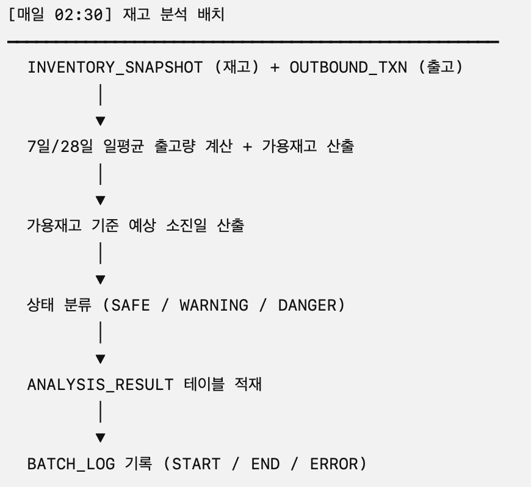
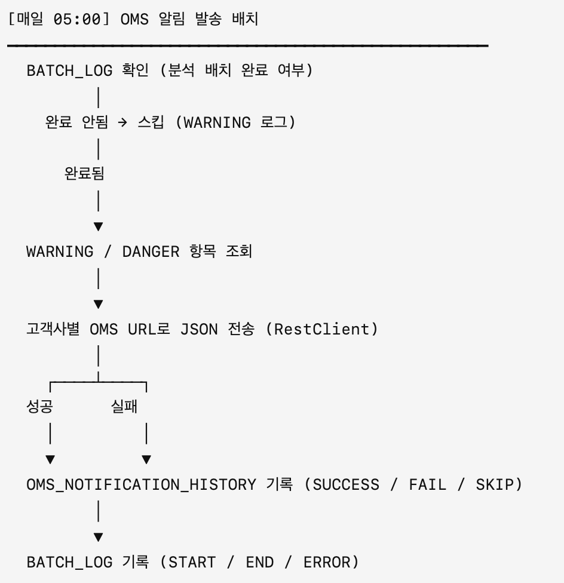

# 📦 IAF - Inbound Advisory Forecasting
> 재고 데이터를 기반으로 소진 시점을 예측하고, OMS 연동을 통해 선제적 출고 요청을 자동화하는 WMS 운영 지원 시스템

- 본 프로젝트는 3PL 풀필먼트 환경에서 출고 패턴이 비교적 안정적인 생필품 브랜드를 가정하고,  
고객사 SKU별 입·출고 이력과 재고 데이터를 분석하여 재고 위험도를 분류하고 OMS로 자동 연동하는 시스템입니다.
- 운영자가 재고 부족을 사전에 인지하고 대응할 수 있도록 배치 기반 분석과 알림 기능을 구현했습니다.

## 🔍 기술 스택

- Spring Boot 4.0.2
- Java 17
- MyBatis
- MariaDB
- JSP (Server-Side Rendering)
- Maven (WAR Packaging)
- Spring RestClient (HTTP 연동)
- Logback (스케줄러 로그 관리)

## 📊 주요 기능
### 1️⃣ 재고 분석 배치 (02:30)

- 최근 7일 / 28일 기준 일평균 출고량 분석
- 가용 재고 기반 예상 소진일 계산
- 재고 상태 자동 분류 (SAFE / WARNING / DANGER)
- ANALYSIS_RESULT 테이블 적재
- BATCH_LOG 기록

### 2️⃣ OMS 자동 알림 발송 배치 (05:00)
- WARNING / DANGER 항목만 선별 전송
- 고객사별 OMS URL로 JSON 전송 (Spring RestClient 기반 HTTP 통신)
- OMS 측 자동 출고 요청 프로세스를 지원하는 연동 구조
- 분석 배치 정상 완료 시에만 실행
- 발송 결과 및 payload DB 기록 (OMS_NOTIFICATION_HISTORY)

### 3️⃣ 웹 화면
- 업체별 입·출고 분석 조회 : 고객사 / 카테고리 / 기준일 / 상태 필터
- OMS 전송 이력 조회 : 발송 결과 확인, 상세 JSON payload / 오류 메시지 조회

## 🔄 배치 프로세스 흐름

## ⚒️ 기술적 고려사항
- 고객사별 OMS URL 미설정 시 스킵 처리 및 로그 레벨 구분
- OMS 발송 배치 실행 전 분석 배치 정상 완료 여부를 BATCH_LOG로 검증하여 데이터 무결성 보장
- JSON payload 정렬 통일을 통한 API 검증 안정성 확보
- 발송 실패 건 DB 저장으로 재처리 기반 확보

